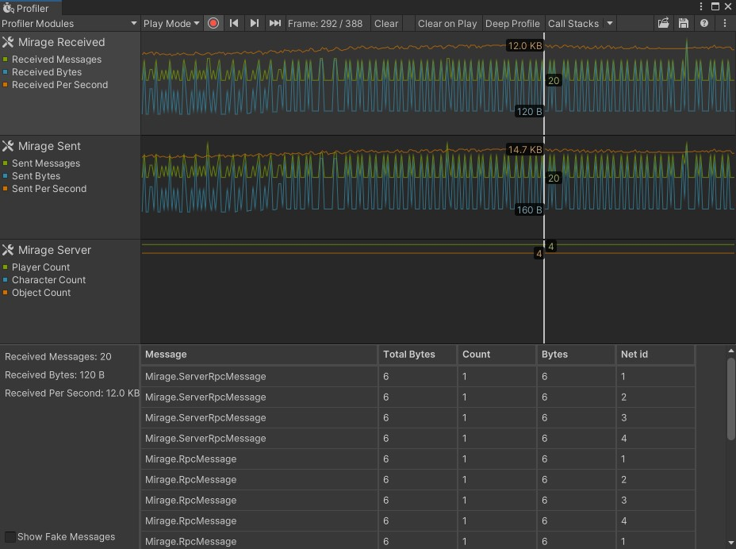

[](https://discordapp.com/invite/DTBPBYvexy)
[](https://github.com/James-Frowen/Mirage.Profiler/releases/latest)
[](https://github.com/sponsors/James-Frowen)

# Mirage.Profiler (work in progress)

Network Profiler for [Mirage](https://github.com/MirageNet/Mirage) using the new [unity profiler package](https://docs.unity3d.com/Packages/com.unity.profiling.core@1.0/manual/index.html)


Thanks to https://github.com/JesusLuvsYooh/MirrorNetworkProfiler for some reference code.



## How to install

Add Required package: `"com.unity.profiling.core": "1.0.2"` if using package manager this will be done automatically

### Unity package manager (Mirage only)
use package manager to get the latest version, or replace `#master` with the full hash of the commit.

branch:
```
"com.james-frowen.mirage-profiler": "https://github.com/James-Frowen/Mirage.Profiler.git?path=/Assets/Mirage.Profiler#master",
```
commit hash:
```
"com.james-frowen.mirage-profiler": "https://github.com/James-Frowen/Mirage.Profiler.git?path=/Assets/Mirage.Profiler#bfb3edbf5b70cc91700ddcb434e8883019282b3e",
```

### Unity package

Download unity package from [release page](https://github.com/James-Frowen/Mirage.Profiler/releases) make sure to select the version for Mirage or Mirror depending on what you are using


## How to use:

1) Add NetworkProfilerBehaviour to NetworkManager
2) Open Unity's Profiler and select the "Network Profiler" module
3) Press play, and start server or client

## Development TODO

- [x] Send and received counters
- [x] Bytes per second
- [x] Table for messages
- [x] ScrollBar for table (height get squashed with no scrollbar)
- [x] Group by Message type
- [x] Add Sort by column
- [x] Saving messages so that they can be viewed outside of playmode
- [ ] Add GameObject Name from netid
- [ ] Save expanded group settings (which which groups are expanded, apply when loading new frame)
- [x] Fix crash on close

### Maybe Future
- [ ] Flexable width of table
- [ ] Multi-instance support for mirage (give option to pick which server/client NetworkDiagnostics uses)